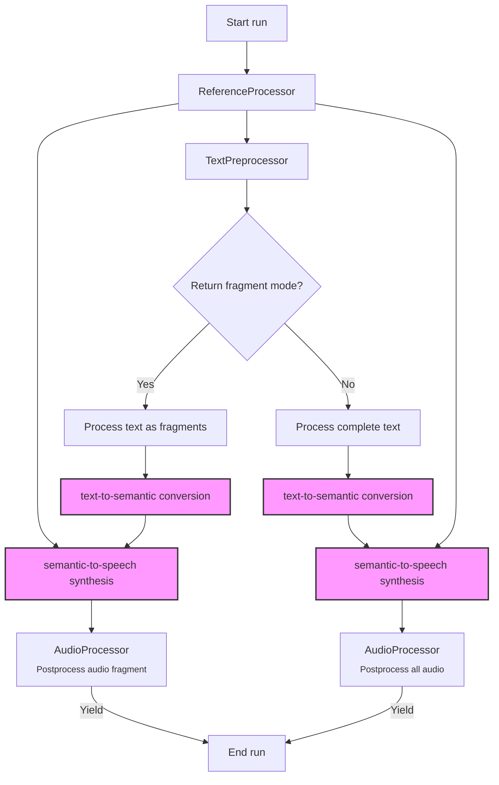
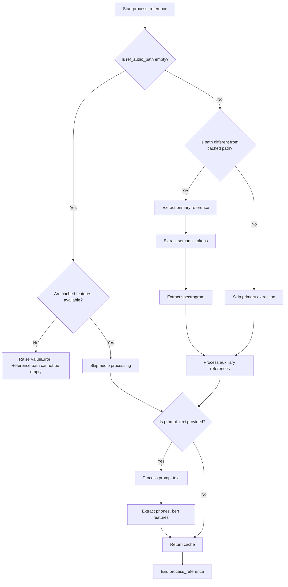

# Ominix-TTS Pipeline Introduction
## TTS Pipeline

Ominix-TTS pipeline transforms input text into synthesized speech using a two-stage pipeline: text-to-semantic conversion followed by semantic-to-speech synthesis.

- **Reference Voice Setup**:
    - Loads and processes reference audio to capture the target voice characteristics
    - Handles prompt text if provided to guide the synthesis

- **Text Preprocessing**:
   - Segments the input text using the specified method
   - Converts text to phonetic and linguistic features
   - Organizes the data into batches for efficient processing

- **Semantic Token Generation**:
   - Uses the Text2Semantic model to convert text features into semantic tokens
   - Applies sampling techniques (temperature, top-k, top-p) to control generation

- **Audio Synthesis**:
   - Feeds semantic tokens into the VITS model to generate audio waveforms
   - Handles both standard and V3 model variants with different synthesis approaches
   - Supports parallel or sequential processing based on configuration

- **Audio Post-processing**:
   - Concatenates audio fragments with appropriate intervals
   - Applies speed modification if requested
   - Optionally performs super-sampling for higher audio quality
   - Formats the audio for output

The pipeline operates as a generator, yielding audio samples either:
- All at once when `return_fragment=False`
- Fragment by fragment when `return_fragment=True`

Each yield returns a tuple containing the sample rate and audio waveform data.      



## Reference Voice Setup

Reference processing handles both audio and text reference material for voice cloning, with careful attention to caching for better performance.
- Loads and processes reference audio to capture the target voice characteristics
- Handles prompt text if provided to guide the synthesis


 
## Clean Reinstall package during development
```
# 1. Uninstall the package
pip uninstall -y ominix-tts

# 2. Remove build artifacts
rm -rf build dist *.egg-info
# unnecessary to remove __pycache__
# find . -type d -name __pycache__ -exec rm -rf {} +;

# 3. Clear pip's cache
pip cache purge

# 4. Reinstall
pip install .
```